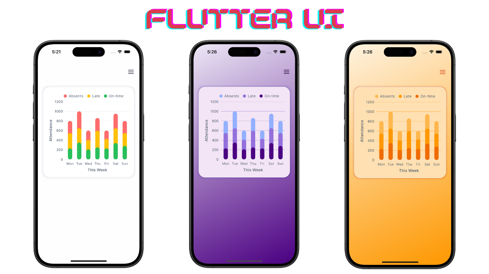

# 📊 Flutter Syncfusion Chart UI – Premium Dashboard Component

A beautifully crafted Flutter chart UI built with **Syncfusion**, **Riverpod**, and **Clean Architecture** – designed to drop seamlessly into any modern Flutter app.

## 🚀 Features

- 📈 Syncfusion-powered charts (line, bar, area, and more)
- 🧠 Riverpod for clean and scalable state management
- 🎨 Light & dark theme support
- 🏗️ Modular code with clean architecture (UI, domain, data layers)
- 📱 Fully responsive for Android and iOS

## 💡 Ideal For

- Flutter dashboards & analytics apps  
- Developer portfolios or production apps

## 🛠️ Tech Stack

- Flutter (latest stable SDK)
- Syncfusion Flutter Charts
- Riverpod (v2+)
- Clean Architecture Principles

## 🖼️ Visual Representation
<table align="center">
  <tr>
    <th>📱 Demo Using Normal Chart UI</th>
    <th>📱 Demo Using Premium Chart UI</th>
  </tr>
  <tr>
    <td align="center">
      
    </td>
    <td align="center">
      
    </td>
  </tr>
</table>

## 📦 Get the Premium Version
Want to use the premium chart UI showcasing a stylish chart as shown below?

   
  

Head over to gumroad by clicking the below button 👇👇👇

  

# Liked My Work

Support me by buying a coffee

---

## 🔗 Related Links
- 📘 [Syncfusion Flutter Docs](https://pub.dev/packages/syncfusion_flutter_charts)
- 🧠 [Riverpod State Management](https://riverpod.dev)

---

## 👨‍💻 Author

**Hamza Bilal** – Flutter Developer & Digital Nomad  
📫 [Follow me on GitHub](https://github.com/HBGaya)  
🌍 [Check more premium UIs & Apps](https://hamzabilal5.gumroad.com/)

---

> ⚠️ _This repo is for demo and educational purposes only.
